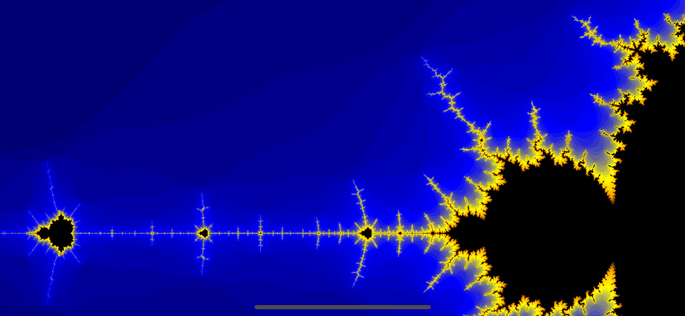

# Mandelbrot using Swift and Metal on iOS

***Updated to Swift 5.1, Xcode 11.4***

Sample implementation of the Mandelbrot fractal to familiarize myself with Metal and Swift on iOS.

Uses pinch to zoom in and out. Zooming in is limited by the precision of the type CGDouble.

